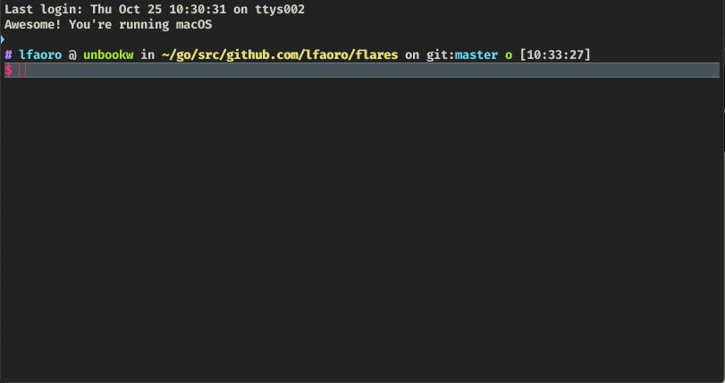

# Flares 🔥

Flares is a CloudFlare DNS backup tool: every time it runs, dumps your DNS table to the screen.

Optionally exports the data into (BIND formatted) zone files.

[](LICENSE) [](https://goreportcard.com/report/github.com/lfaoro/flares)



## Quick Start - docker (painless)
```bash
# CloudFlare auth key is here: https://dash.cloudflare.com/profile ->
# Global API Key -> View
$ docker run -it --rm \
-e CF_AUTH_KEY="" \
-e CF_AUTH_EMAIL="" \
lfaoro/flares domain1.tld domain2.tld
```

## Quick Start - compile (full control)
Golang must be installed: https://golang.org/dl/
```bash
# flaredns
$ go get -u github.com/lfaoro/flares/cmd/flaredns
$ cd $GOPATH/src/github.com/lfaoro/flares/
# flarelogs (coming soon)
# $ go get -u github.com/lfaoro/flares/cmd/flarelogs
```
### Set the API key and account email address.
```bash
$ flaredns auth # (coming soon) opens the dashboard at https://dash.cloudflare.com/profile
$ export CF_API_KEY=abcdef1234567890
$ export CF_API_EMAIL=someone@example.com
```
### Run the app
```bash
$ make install
$ flaredns -h
$ flaredns domain.tld
$ flaredns export -d /tmp/tables/ domain.tld
```

# Contributing
> Any help and suggestions are very welcome and appreciated. Start by opening an [issue](https://github.com/lfaoro/flares/issues/new).

- Fork the project
- Create your feature branch `git checkout -b my-new-feature`
- Commit your changes `git commit -am 'Add my feature'`
- Push to the branch `git push origin my-new-feature`
- Create a new pull request against the master branch

## TODO
- [ ] use https://github.com/spf13/cobra for the CLI interface
- [ ] add the flarelogs command
- [ ] add `all` keyword to export all the domains available in the account
- [ ] add `auth` command, automatically opens CloudFlare dashboard
